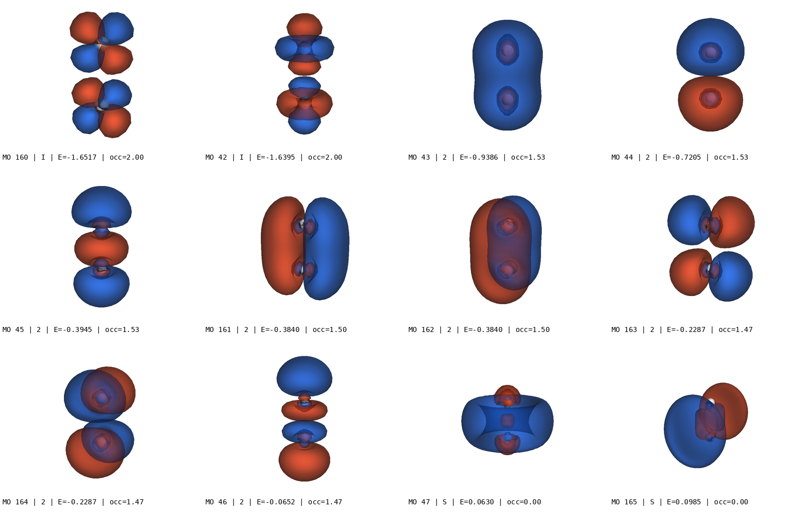

# pegamoid_batch_export

Batch export molecular orbital images from [OpenMolcas](https://gitlab.com/Molcas/OpenMolcas) HDF5 and Molden files. Uses [Pegamoid](https://gitlab.com/Jellby/Pegamoid)'s orbital computation engine with VTK offscreen rendering to produce publication-quality PNG images and montage grids — no GUI or display required.



## Features

- Reads OpenMolcas `.rasscf.h5`, `.scf.h5`, and `.molden` files
- Auto-selects active space orbitals from `MO_TYPEINDICES` (RAS1/RAS2/RAS3)
- Handles multiple irreps (contiguous block detection for neighbor selection)
- Sorts orbitals by energy (default) or index
- Configurable camera angle, isovalue, resolution, colors, and opacity
- Creates labeled montage grid images with orbital metadata
- Runs fully offscreen (headless) — works on Linux, macOS, Windows, and WSL

## Installation

```bash
pip install -r requirements.txt
```

This installs:
- **Pegamoid 2.12.4** — orbital file reader and grid computation
- **VTK** — offscreen 3D rendering
- **h5py** — HDF5 file access
- **NumPy** — numerical computation
- **Pillow** — montage image creation

## Quick Start

Export active space orbitals with 1 neighbor on each side:
```bash
python pegamoid_batch_export.py calculation.rasscf.h5 --active --neighbors 1
```

Export specific orbitals by index (1-based):
```bash
python pegamoid_batch_export.py calculation.rasscf.h5 --orbitals 41,42,43,44,45,46
```

Use a tilted camera for 3D perspective:
```bash
python pegamoid_batch_export.py calculation.rasscf.h5 --active --camera 20,15
```

## Options

| Option | Default | Description |
|--------|---------|-------------|
| `--output-dir`, `-o` | `./orbitals` | Output directory for PNG files |
| `--orbitals` | — | Comma-separated orbital indices (1-based) |
| `--active` | off | Auto-select active space orbitals |
| `--neighbors`, `-n` | 0 | Include N neighbor orbitals per irrep block |
| `--isovalue` | 0.03 | Isosurface cutoff value |
| `--resolution`, `-r` | 60 | Grid points per axis |
| `--padding` | 10.0 | Box padding around molecule (Bohr) |
| `--width` | 800 | Image width in pixels |
| `--height` | 600 | Image height in pixels |
| `--opacity` | 0.7 | Orbital lobe opacity |
| `--camera` | `x` | View direction: `x`, `y`, `z`, or `azimuth,elevation` in degrees |
| `--sort` | `energy` | Sort by `energy` or `index` |
| `--montage-cols` | 4 | Columns in montage grid |
| `--no-montage` | off | Skip montage creation |

## Output

The script produces:
- **Individual PNGs**: one per orbital, named `<basename>_mo<NNN>.png`
- **Montage PNG**: grid of all orbitals with labels showing MO index, type (I/2/S/...), energy, and occupation

## Orbital Types (OpenMolcas)

| Code | Meaning |
|------|---------|
| F | Frozen |
| I | Inactive |
| 1 | RAS1 (active) |
| 2 | RAS2 (active) |
| 3 | RAS3 (active) |
| S | Secondary (virtual) |
| D | Deleted |

## Platform Notes

- **Linux/macOS**: Works out of the box with VTK offscreen rendering
- **WSL**: Works with offscreen VTK (no display needed)
- **Windows**: Works with VTK offscreen rendering; Pegamoid GUI also available separately

## How It Works

The script imports Pegamoid's `Orbitals` class to read basis set data and compute molecular orbital values on a 3D grid. It then uses VTK's `vtkContourFilter` to generate isosurfaces at the specified cutoff value, renders them offscreen with `vtkRenderWindow`, and saves the result as PNG.

Pegamoid's module-level GUI code (which unconditionally creates a `QApplication`) is bypassed by loading only the library portion of the source.

## License

This project is licensed under the **GNU General Public License v3.0** — see [LICENSE](LICENSE).

This is a derivative work of [Pegamoid](https://gitlab.com/Jellby/Pegamoid) by Ignacio Fdez. Galvan, which is also licensed under GPL v3.0.

## Acknowledgments

- [Pegamoid](https://gitlab.com/Jellby/Pegamoid) by Ignacio Fdez. Galvan — orbital viewer for OpenMolcas
- [OpenMolcas](https://gitlab.com/Molcas/OpenMolcas) — multiconfigurational quantum chemistry
- [VTK](https://vtk.org/) — 3D visualization toolkit
